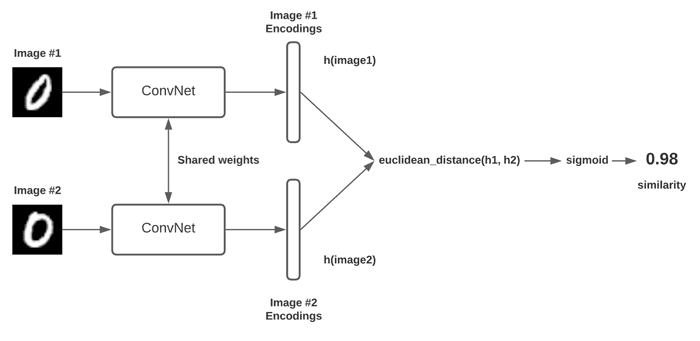

# Siamese Neural Networks for One-Shot Learning 🧠🔍

A comprehensive implementation of Siamese Neural Networks using TensorFlow/Keras for one-shot learning on the MNIST dataset. This project explores different loss functions (Contrastive Loss and Triplet Loss), compares various optimizers, and evaluates the performance of fully connected versus convolutional architectures.



## 📋 Description

This project demonstrates the implementation of Siamese Neural Networks, a powerful architecture for similarity learning and one-shot classification tasks. The networks learn to recognize whether two input images belong to the same class by learning embeddings that place similar examples close together and dissimilar examples far apart in the feature space.

The implementation includes comprehensive experiments comparing different loss functions, optimizers, and network architectures to identify the optimal configuration for MNIST digit recognition.

<br>
<div align="center">
  <a href="https://codeload.github.com/TendoPain18/siamese-neural-networks/legacy.zip/main">
    
  </a>
</div>

## 🎯 Project Objectives

1. **Implement Siamese Networks**: Build twin neural networks with shared weights
2. **Compare Loss Functions**: Evaluate Contrastive Loss vs Triplet Loss
3. **Optimize Performance**: Test different optimizers (Adam, RMSprop, SGD)
4. **Evaluate Architectures**: Compare fully connected vs convolutional networks
5. **Achieve One-Shot Learning**: Enable recognition from minimal training examples

## ✨ Features

### Network Architectures
- **Fully Connected Siamese Network**: Dense layers with L2 normalization
- **Convolutional Siamese Network**: CNN-based feature extraction with spatial hierarchies
- **Shared Weight Architecture**: Twin networks with identical parameters

### Loss Functions
- **Contrastive Loss**: Pairwise similarity learning with margin-based separation
- **Triplet Loss**: Anchor-positive-negative triplet optimization

### Training Components
- **Data Pair Generation**: Automatic creation of similar and dissimilar pairs
- **Triplet Generation**: Anchor-positive-negative triplet construction
- **Multiple Optimizers**: Adam, RMSprop, SGD with momentum
- **Performance Metrics**: Custom accuracy computation and loss tracking

### Visualization
- **Training/Validation Curves**: Loss and accuracy progression
- **Image Pair Display**: Visual inspection of training samples
- **Prediction Visualization**: Compare ground truth with model predictions
- **Optimizer Comparison**: Performance analysis across different optimizers

## 🔬 Theoretical Background

### Siamese Network Architecture

**Concept**: Two identical neural networks (twins) process two different inputs and produce embeddings that can be compared for similarity.

**Structure**:
```
Input 1 → Network (θ) → Embedding 1
                              ↓
                         Distance Metric
                              ↓
Input 2 → Network (θ) → Embedding 2
```

Where both networks share the same parameters θ.

### Contrastive Loss

**Formula**:
```
L = y × D² + (1 - y) × max(0, margin - D)²
```

Where:
- `y` = Label (1 for similar pairs, 0 for dissimilar)
- `D` = Euclidean distance between embeddings
- `margin` = Separation margin for dissimilar pairs (typically 1.0)

**Behavior**:
- Similar pairs (y=1): Minimize distance D
- Dissimilar pairs (y=0): Maximize distance up to margin

### Triplet Loss

**Formula**:
```
L = max(0, D(A, P) - D(A, N) + margin)
```

Where:
- `A` = Anchor image
- `P` = Positive image (same class as anchor)
- `N` = Negative image (different class)
- `D(A, P)` = Distance between anchor and positive
- `D(A, N)` = Distance between anchor and negative

**Objective**: Ensure anchor is closer to positive than to negative by at least margin.

### Euclidean Distance

**Formula**:
```
D(x, y) = √(Σ(x_i - y_i)²)
```

**Usage**: Measures similarity in embedding space

## 📊 Experimental Results

### Loss Function Comparison

| Loss Function | Test Accuracy | Convergence Speed |
|---------------|---------------|-------------------|
| Contrastive Loss | 97.14% | Fast |
| Triplet Loss | 99.28% | Moderate |

**Analysis**: Triplet loss achieved higher accuracy by explicitly optimizing the relative distances between anchor-positive and anchor-negative pairs, though it requires more training time.

### Optimizer Comparison (Contrastive Loss)

| Optimizer | Test Accuracy | Training Characteristics |
|-----------|---------------|-------------------------|
| Adam | 97.14% | Baseline performance |
| RMSprop | 96.81% | Faster convergence |
| SGD (momentum=0.9) | 95.62% | Slower but stable |

**Recommendation**: Adam provides the best balance of performance and convergence speed for this task.

### Architecture Comparison

| Architecture | Test Accuracy | Parameters | Training Time |
|--------------|---------------|------------|---------------|
| Fully Connected | 97.14% | 91,584 | Fast |
| Convolutional | 98.78% | 428,672 | Moderate |

**Key Insight**: Convolutional architecture achieves 1.64% higher accuracy by leveraging spatial hierarchies in MNIST digits, demonstrating the importance of architectural choices for image data.

## 🚀 Getting Started

### Prerequisites

**Python Requirements:**
```
Python 3.7+
TensorFlow 2.x
NumPy
Matplotlib
Keras
```

### Installation

1. **Clone the repository**
```bash
git clone https://github.com/yourusername/siamese-neural-networks.git
cd siamese-neural-networks
```

2. **Install dependencies**
```bash
pip install tensorflow numpy matplotlib
```

3. **Run the notebook**
```bash
jupyter notebook siamese_networks.ipynb
```

## 📖 Usage Guide

### Training Siamese Network with Contrastive Loss

```python
# Build model
model = build_siamese_model()
model.compile(loss=contrastive_loss, optimizer="adam", metrics=[accuracy])

# Train
history = model.fit(
    [pairs_train[:, 0], pairs_train[:, 1]], 
    labels_train,
    batch_size=128,
    epochs=10,
    validation_data=([pairs_test[:, 0], pairs_test[:, 1]], labels_test)
)

# Evaluate
predictions = model.predict([pairs_test[:, 0], pairs_test[:, 1]])
test_accuracy = compute_accuracy(labels_test, predictions)
```

### Training with Triplet Loss

```python
# Create triplets
triplets_train = make_triplets(X_train, Y_train)

# Build triplet model
model = build_triplet_model()
model.compile(
    optimizer="adam",
    loss=triplet_loss(margin=1.0),
    metrics=[triplet_accuracy]
)

# Train
history = model.fit(
    [A_train, P_train, N_train],
    dummy_labels,
    validation_data=([A_test, P_test, N_test], dummy_test_labels),
    epochs=10,
    batch_size=128
)
```

### Visualizing Predictions

```python
# Display image pair with prediction
visualize_model_prediction(
    model, 
    pairs_test, 
    labels_test, 
    sample_index,
    distance_threshold=0.5
)
```

## 🎓 Key Concepts

### One-Shot Learning

Ability to recognize objects from a single training example per class, achieved by learning similarity rather than classification.

### Embedding Space

High-dimensional feature representation where similar examples are mapped close together and dissimilar examples are separated.

### Shared Weights

Both twin networks use identical parameters, ensuring consistent feature extraction for both inputs.

### Distance Metrics

- **L2 (Euclidean)**: Standard distance in embedding space
- **Cosine Similarity**: Alternative for normalized embeddings

## 🔍 Pros and Cons

### Advantages
- **Few-Shot Learning**: Effective with minimal training examples per class
- **Semantic Similarity**: Learns meaningful feature representations
- **Transfer Learning**: Embeddings generalize to unseen classes
- **Scalability**: Add new classes without retraining entire network

### Limitations
- **Training Complexity**: Requires pairwise or triplet data generation
- **Slower Training**: More epochs needed compared to standard classification
- **Output Format**: Produces distances rather than class probabilities
- **Memory Requirements**: Processes multiple inputs simultaneously

## 🤝 Contributing

Contributions are welcome! Feel free to:

- Experiment with different architectures
- Implement additional loss functions
- Test on other datasets
- Optimize hyperparameters

## 📄 License

This project is licensed under the MIT License - see the [LICENSE](LICENSE) file for details.

## 🙏 Acknowledgments

- TensorFlow/Keras team for the deep learning framework
- MNIST dataset providers
- Siamese Networks research community

<br>
<div align="center">
  <a href="https://codeload.github.com/TendoPain18/siamese-neural-networks/legacy.zip/main">
    
  </a>
</div>

## <!-- CONTACT -->
<!-- END CONTACT -->

## **Master similarity learning with Siamese Networks! 🧠✨**
